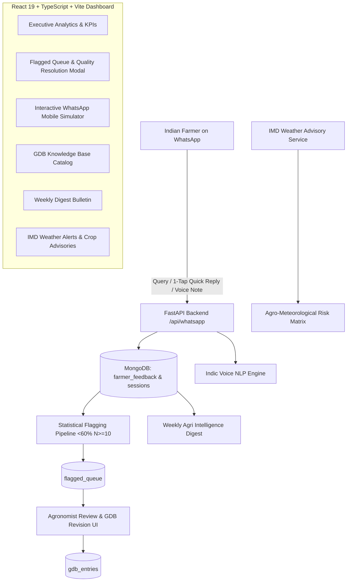

# AjraSakha Agri-Intel | Farmer Feedback & Autonomous Quality Assurance System

> **Farmer Answer Feedback Loop & Quality Pipeline for AjraSakha (ANNAM.AI / IIT Ropar)**

This system provides a full-stack automated quality feedback suite for Indian farmers interacting with the **AjraSakha** agricultural advisory bot. It captures 1-tap quick replies, multi-turn dissatisfaction drill-downs, Multimodal Indic Voice Notes, smart Agro-Chrono evening leisure nudges, statistical flagging of deteriorating answers, and live IMD weather risk advisories.

---

## 🌾 System Architecture



---

## 🚀 Running the Project

### 1. Prerequisites
- **Python 3.12+** with `uv` package manager
- **Node.js 18+** with `npm`
- **MongoDB** running locally on `localhost:27017`

### 2. Backend Setup
From the repository root or `backend/` folder:
```bash
# Seed the MongoDB database with initial knowledge entries & 300+ feedback records
uv run python backend/seed_data.py

# Start the FastAPI server (Runs on http://localhost:8000)
uv run python -m uvicorn app.main:app --port 8000 --reload
```

### 3. Frontend Setup
From the `frontend/` folder:
```bash
cd frontend

# Install dependencies (already installed)
npm install

# Start the Vite development server with proxy to backend
npm run dev
```

Open your browser at **`http://localhost:5173`**.

---

## 🗺️ Route Endpoints (React Router DOM)

| Endpoint | Page Component | Description |
| :--- | :--- | :--- |
| **`/`** or **`/analytics`** | [AnalyticsPage.tsx](file:///c:/Dev/FarmersFeedback/frontend/src/pages/AnalyticsPage.tsx) | Executive analytics KPI counters, domain performance, root causes & regional stats |
| **`/flagged`** | [FlaggedPage.tsx](file:///c:/Dev/FarmersFeedback/frontend/src/pages/FlaggedPage.tsx) | Statistical flagging queue (<60% helpfulness), agronomist resolution modal & threshold settings |
| **`/whatsapp`** | [WhatsAppPage.tsx](file:///c:/Dev/FarmersFeedback/frontend/src/pages/WhatsAppPage.tsx) | Mobile WhatsApp simulator with 2-turn feedback loop, quick reply buttons, voice note NLP & evening nudge |
| **`/gdb`** | [GdbPage.tsx](file:///c:/Dev/FarmersFeedback/frontend/src/pages/GdbPage.tsx) | Searchable Knowledge Base catalog with crop & domain filters |
| **`/digest`** | [DigestPage.tsx](file:///c:/Dev/FarmersFeedback/frontend/src/pages/DigestPage.tsx) | Weekly Agri Intelligence executive bulletin with export/print capability |
| **`/weather`** | [WeatherPage.tsx](file:///c:/Dev/FarmersFeedback/frontend/src/pages/WeatherPage.tsx) | Live IMD Agro-Meteorological warnings & crop advisory checklist |
| **`*`** | [NotFoundPage.tsx](file:///c:/Dev/FarmersFeedback/frontend/src/pages/NotFoundPage.tsx) | 404 handler with redirection back to executive analytics |

---


## ✨ Integrated Features

### 1. 📊 Executive Analytics
- Real-time KPI metrics: **Overall Helpfulness %**, **Total Feedbacks Captured**, **Voice Notes Count**, **GDB Entries**, and **Flagged Queue**.
- **Domain Breakdown**: Helpfulness satisfaction across Pest & Disease, Nutrient & Fertilizer, Irrigation Scheduling, and Weed Management.
- **Root-Cause Analysis**: High-impact breakdown of why farmers gave negative feedback (*Unclear Dosage*, *Incorrect Chemical*, *Wrong Stage*, *High Cost*, *Weather Mismatch*, *Complex Language*).
- **Regional Heatmap/Cards**: State-level satisfaction across Punjab, Haryana, Rajasthan, Uttar Pradesh, etc.

### 2. 🚨 Statistical Flagging & Resolution Pipeline
- Auto-detects poorly performing GDB entries falling below configurable thresholds (`< 60% helpful`, `N >= 10`).
- Side-by-side comparison of original Hindi and English answers.
- In-depth **Resolution Modal**: Allows agronomists to edit `revised_answer_hi` and `revised_answer_en`, add reviewer notes, commit updates directly to MongoDB, and automatically update the GDB catalog.
- Dynamic threshold configuration panel (`POST /api/flagged/config`).

### 3. 💬 Interactive WhatsApp Simulator
- Authentic WhatsApp mobile phone interface simulating the two-turn farmer experience.
- **Turn 1**: Farmer asks questions (text or voice) & receives verified agricultural advice with **1-Tap Quick-Reply Buttons** (`👍 हाँ, मददगार है` / `👎 नहीं, सुधार चाहिए`).
- **Turn 2**: Drill-down on dissatisfaction with instant root-cause buttons.
- **Indic Voice Note Processing**: Simulates Hindi/Punjabi voice notes with NLP sentiment analysis (Positive/Negative) and automatic rating.
- **Agro-Chrono Evening Leisure Nudge**: Simulates 7:00 PM – 9:00 PM nudges sent to farmers after fieldwork.
- **Session Inspector**: Live view and reset button for the farmer's session state machine (`IDLE`, `ANSWER_DELIVERED`, `AWAITING_ROOT_CAUSE`).

### 4. 📚 GDB Knowledge Base Catalog
- Full directory of verified agricultural Q&As with live search across Hindi and English text, crop filters, and domain filters.

### 5. 📰 Weekly Agri Intelligence Digest
- Automated quality bulletin featuring executive summaries, critical action items, lowest performing GDB entries, and regional hotspots.

### 6. 🌦️ IMD Weather Risk Matrix
- Live agro-meteorological alerts (Frost, Rainfall, Heatwaves) and dynamic crop-specific advisory generator with actionable checklists.
